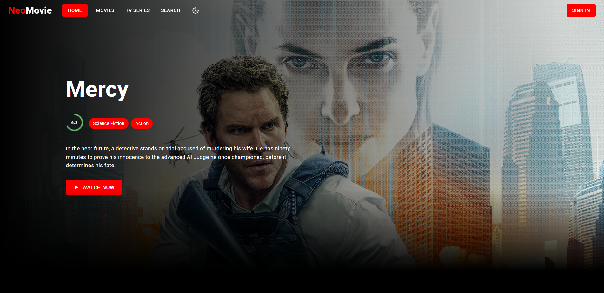
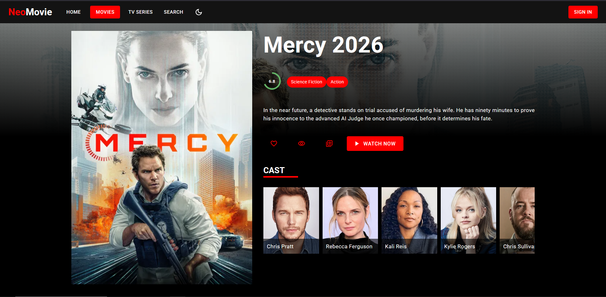
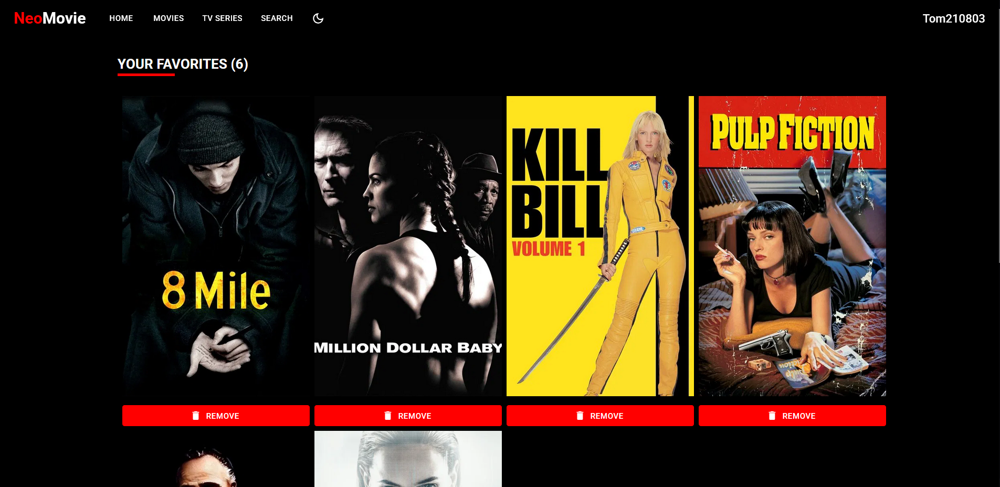

# 🎬 NeoMovie

NeoMovie is a premium, full-stack responsive movie exploration platform. It allows users to discover the latest films, TV series, and actor details with a sleek and modern interface.


## ✨ Features

- **Dynamic Discovery**: Browse the latest and trending movies and TV shows.
- **Detailed Insights**: Access deep-dive information for every title, including cast, crew, and ratings.
- **Actor Profiles**: Explore actor filmographies and biographies.
- **Search Functionality**: Quickly find any movie or series.
- **Responsive Design**: Optimized for mobile, tablet, and desktop viewing.
- **Modern UI**: Built with Material UI for a clean, professional aesthetic.

## 📸 Screenshots

|                  Home Page                  |                   Movie Details                   |
| :-----------------------------------------: | :-----------------------------------------------: |
|  |  |

|                      Favorites                       |
| :--------------------------------------------------: |
|  |

## 🛠 Tech Stack

### Frontend

- **React** (v18)
- **Redux Toolkit** (State Management)
- **Material UI** (Design System)
- **Swiper** (Modern sliders)
- **Axios** (API Requests)

### Backend

- **Node.js** & **Express**
- **MongoDB** & **Mongoose** (Database)
- **JWT** (Authentication)

### DevOps

- **Docker** & **Docker Compose**

## 🚀 Getting Started

### Prerequisites

- Docker & Docker Compose installed on your machine.

### Installation

1. **Clone the repository**:

   ```bash
   git clone git@github.com:juniorconseiltaker-technicaltest/my_allocine_TOM_ROGER.git
   cd NeoMovie
   ```

2. **Launch with Docker**:

   ```bash
   docker-compose up --build
   ```

3. **Access the application**:
   Open your browser and navigate to `http://localhost:3000`.

## 🔧 Troubleshooting

- **Port Conflicts**: If port 3000 or 5000 is already in use, ensure other containers are stopped:
  ```bash
  docker-compose down -v
  ```
- **Database Issues**: If you have a local MongoDB service running, you might need to stop it to avoid conflicts with the Docker container:
  ```bash
  sudo systemctl stop mongodb
  ```
- **Docker Daemon**: Ensure Docker is running:
  ```bash
  sudo systemctl start docker
  ```

## 📬 Contact

Created by **Tom Roger** - [tom.roger@epitech.eu](mailto:tom.roger@epitech.eu)
